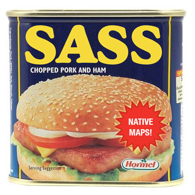

## Sass Maps Plus

These functions are under development. They are the successor to my [Sass List–Maps](http://github.com/lunelson/sass-list-maps) project. They provide advanced native map data-type manipulation and inspection in [libsass (as of version 3.1)](http://libsass.org/) and [ruby-sass (as of version 3.3)](http://sass-lang.com/).

#### Updates

* 0.9.2 -- break apart files in to partials, fix empty-argument edge case for nested merging.
* 0.9.0 -- working `map-get-z()`, `map-merge-z()`, and `map-inspect()` functions for native maps.

TODO: more.